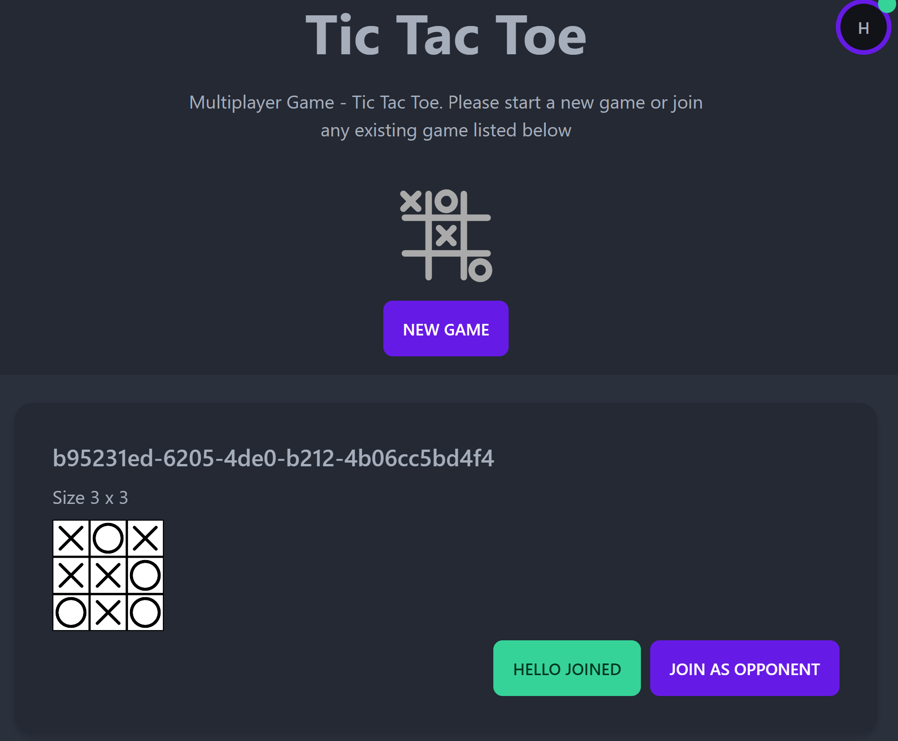

# Tic Tac Toe

This is a multi-player game written in Typescript with server / client support, the codebase split into 3 packages under a monorepo setup.

## @ttt/lib

-   This is a core library for the game logic
-   The game allow both player and opponent to play at the same time
-   It supports AI move (minmax algorithm) if either player or opponent is playing the game alone.

## @ttt/server

-   Node.JS hosting server using libraries such as
    -   Express.JS
    -   Socket.IO (server)
    -   Winston - Logger
-   List of created games created by the client and allow the clients to connect into the game.
-   Any move on the game will be stored into the server to prevent cheating.

## @ttt/client

-   React web client to allow user to interact with the hosting server
    -   ReactJS
    -   Tailwind / DaisyUI
    -   Socket.IO (client)
    -   LocalStorage - For the game data and system state
-   The client could create multiple games on the server via the web interface
-   Join one game at the time, and either could play with opponent or the AI (If no opponent joining the game)
-   Whenever the game state is updated on the server, the client would sync the games in real-time

## How to Start

-   Git clone the repo `git clone https://github.com/lancon13/ttt.git`
-   Install the dependencies `yarn install` or `npm install`
-   Run it as development mode `yarn dev` or `npm run dev`
-   Open the browser and navigate to the `http://localhost:5173`

## Known issues

Unfortunately the implementation is still in very early beta stage

-   The web client will crash if refresh the browser
-   If the server crashes the the client will not be able to function.
-   It will needs to delete the browser LocalStorage if things are not working properly (Delete the Application -> Storage -> Local Storage -> Key:ttt-data)
-   The connection seems unstable due to the React rendering loop issue
-   The implementation of showing the Winning state is not yet completed (i.e. the game won't determine who's the winner)

## TODO

-   Re-structure the React components
-   A better UI library... (The DaisyUI seems missing many useful components)
-   A better Socket.IO events flow...
-   A Database to store the game structure, currently everything are stored in just memory and it's suffer from instability issues.
     
     
     
     
     
    
